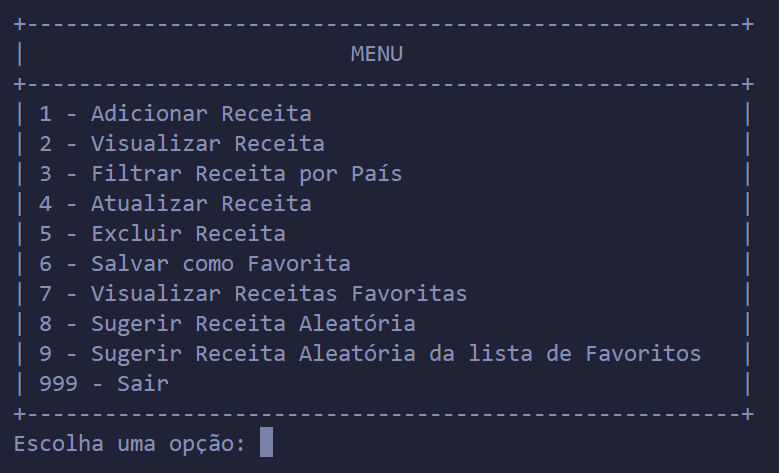

# Projeto-FPA

# Manual de Instruções para o Gerenciador de Receitas

**Cesar School - Fundamentos da Programação**  
**Carol Melo - Victor Cavalcanti**  
**Grupo: João Henrique, Matheus de Lucena, Rafael Serpa, João Pedro**

## Sumário
1. [Adicionar Receita](#1-adicionar-receita)
2. [Visualizar Receita](#2-visualizar-receita)
3. [Filtrar Receita por País](#3-filtrar-receita-por-país)
4. [Atualizar Receita](#4-atualizar-receita)
5. [Excluir Receita](#5-excluir-receita)
6. [Salvar como Favorita](#6-salvar-como-favorita)
7. [Visualizar Receitas Favoritas](#7-visualizar-receitas-favoritas)
8. [Sugerir Receita Aleatória](#8-sugerir-receita-aleatória)
9. [Sugerir Receita Aleatória da lista de Favoritos](#9-sugerir-receita-aleatória-da-lista-de-favoritos)
10. [Sair](#10-sair)
11. [Mensagens de Erro Comuns](#mensagens-de-erro-comuns)
12. [Fluxograma](#fluxograma)

## Introdução
Este gerenciador de receitas é um programa desenvolvido para ajudar a organizar, visualizar, adicionar, atualizar, excluir e sugerir receitas de maneira eficiente. Além disso, você pode marcar receitas como favoritas e acessá-las facilmente. O programa lê e escreve dados em arquivos CSV (`receitas.csv` e `receitas_favoritas.csv`).

## Iniciando o Programa
Certifique-se de que você possui o arquivo `receitas.csv` no mesmo diretório do seu script Python. O arquivo deve conter uma linha de cabeçalho: `nome, país, ingredientes, preparo`.  
Execute o script Python.

## Menu Principal
Ao iniciar o programa, você verá um menu com as seguintes opções:

## Funcionalidades

### 1. Adicionar Receita
**Descrição:** Permite adicionar uma nova receita ao arquivo `receitas.csv`.

**Passos:**
1. Digite "1" no programa.
2. Insira o nome da receita, país de origem, ingredientes e modo de preparo quando solicitado.
3. A nova receita será adicionada ao final do arquivo `receitas.csv`.

### 2. Visualizar Receita
**Descrição:** Exibe os detalhes de uma receita específica.

**Passos:**
1. Digite "2" no programa.
2. Digite o nome da receita que deseja visualizar.
3. Se a receita existir, seus detalhes serão exibidos; caso contrário, uma mensagem indicará que a receita não foi encontrada.

### 3. Filtrar Receita por País
**Descrição:** Lista todas as receitas de um país específico.

**Passos:**
1. Digite "3" no programa.
2. Digite o nome do país que deseja filtrar.
3. As receitas desse país serão exibidas.

### 4. Atualizar Receita
**Descrição:** Permite atualizar informações de uma receita existente.

**Passos:**
1. Digite "4" no programa.
2. Digite o nome da receita que deseja atualizar.
3. Escolha a categoria que deseja atualizar (nome, país, ingredientes ou preparo).
4. Insira o novo valor ou escolha adicionar/atualizar ingredientes.
5. As informações serão atualizadas no arquivo `receitas.csv`.

### 5. Excluir Receita
**Descrição:** Remove uma receita do arquivo `receitas.csv`.

**Passos:**
1. Digite "5" no programa.
2. Digite o nome da receita que deseja excluir.
3. A receita será removida do arquivo.

### 6. Salvar como Favorita
**Descrição:** Adiciona uma receita ao arquivo `receitas_favoritas.csv`.

**Passos:**
1. Digite "6" no programa.
2. Digite o nome da receita que deseja marcar como favorita.
3. Se a receita existir e não estiver já marcada como favorita, será adicionada ao arquivo `receitas_favoritas.csv`.

### 7. Visualizar Receitas Favoritas
**Descrição:** Lista todas as receitas marcadas como favoritas.

**Passos:**
1. Digite "7" no programa.
2. Todas as receitas favoritas serão exibidas.

### 8. Sugerir Receita Aleatória
**Descrição:** Sugere uma receita aleatória do arquivo `receitas.csv`.

**Passos:**
1. Digite "8" no programa.
2. Uma receita aleatória será exibida.

### 9. Sugerir Receita Aleatória da lista de Favoritos
**Descrição:** Sugere uma receita aleatória do arquivo `receitas_favoritas.csv`.

**Passos:**
1. Digite "9" no programa.
2. Uma receita favorita aleatória será exibida.

### 10. Sair
**Descrição:** Sai do programa.

**Passos:**
1. Digite "999" no programa.
2. O programa será encerrado.

## Mensagens de Erro Comuns
- **Arquivo não encontrado:** Certifique-se de que o arquivo `receitas.csv` ou `receitas_favoritas.csv` existe no mesmo diretório do script.
- **Erro ao atualizar/salvar receitas:** Verifique se os arquivos não estão em uso por outro programa e se você tem permissão para escrevê-los.
- **Receita não encontrada:** Verifique a ortografia do nome da receita.

## Fluxograma
  

